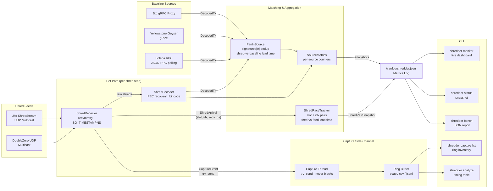

# shredder

Measures the latency advantage of raw Solana shred feeds over confirmed-block RPC.

If your business depends on seeing transactions before your competitors, shredder gives you an estimate of how many milliseconds ahead you are, and whether that edge is holding.

```
====================================================================================================
                      SHREDDER FEED QUALITY  2026-02-25 23:27:33 UTC
====================================================================================================

SOURCE               SHREDS/s   COV%  TXS/s   BEAT%   LEAD avg   LEAD p50   LEAD p95   LEAD p99
----------------------------------------------------------------------------------------------------
bebop                       0      —      0       —          —          —          —          —
jito-shredstream        52585   100%     22    100%   +629.8ms   +598.3ms   +890.1ms  +1124.5ms
rpc                         —      —   4065       —   baseline          —          —          —
----------------------------------------------------------------------------------------------------

EDGE ASSESSMENT:
  ✓  jito-shredstream    AHEAD of RPC  by 629.82ms avg  (10219 samples)

----------------------------------------------------------------------------------------------------
COV% = block shreds received  BEAT% = % of matched txs where feed beat RPC  LEAD = ms before RPC confirms  p50/p95/p99 = percentiles
```

---

## How it works

Solana leaders distribute blocks as shreds over UDP. Feed providers relay those shreds to your machine before the block is confirmed.

shredder:

1. Binds a UDP socket on your multicast interface and receives raw shreds
2. Parses the Agave wire format, runs Reed-Solomon FEC recovery on partial FEC sets
3. Deserializes `Entry` structs via bincode to extract transactions
4. Polls a baseline source (RPC, Yellowstone Geyser, or Jito gRPC proxy) for confirmed transactions in parallel
5. Matches transactions across sources by `signatures[0]`, computes arrival time deltas

Lead time = `T_rpc_confirmed − T_shred_received`. Positive means you were ahead.

All timestamps use `CLOCK_MONOTONIC_RAW` (Linux) — immune to NTP slew.



---

## Requirements

- Linux x86_64
- A shred feed (DoubleZero, Jito ShredStream UDP, or Jito gRPC proxy)
- A baseline source: local Solana RPC node, Yellowstone Geyser endpoint, or Jito ShredStream gRPC proxy
- Rust 1.81+ _(build from source only)_

---

## Install

**RECOMENDED Build from source (requires Rust 1.81+):**

```bash
git clone https://github.com/Haruko-Haruhara-GSPB/shred-probe.git ~/shred-probe
cargo install --path ~/shred-probe
```

# to upgrade from source
```
shredder upgrade --source
```

**Pre-built binary (recommended):**

```bash
curl -fsSL https://github.com/Haruko-Haruhara-GSPB/shred-probe/releases/latest/download/shredder -o /usr/local/bin/shredder && chmod +x /usr/local/bin/shredder
```


---

## Quick start

```bash
# 1. Detect active feeds and write probe.toml
shredder discover

# 2. Start background collection (installs systemd service, persists across reboots)
shredder service start

# 3. Open the live dashboard — Ctrl-C closes the view, collection keeps running
shredder monitor

# Check metrics any time without opening the dashboard
shredder status

# Upgrade to the latest version
shredder upgrade --source
```

---

## Configuration

`probe.toml` defines one or more sources. Mix shred feeds and an RPC baseline:

```toml
# DoubleZero bebop feed
[[sources]]
name = "bebop"
type = "shred"
multicast_addr = "233.84.178.1"
port = 7733
interface = "doublezero1"

# Jito ShredStream feed
[[sources]]
name = "jito-shredstream"
type = "shred"
multicast_addr = "233.84.178.2"
port = 20001
interface = "doublezero1"

# RPC baseline
[[sources]]
name = "rpc"
type = "rpc"
url = "http://127.0.0.1:8899"

# Yellowstone gRPC Geyser baseline (alternative to RPC polling)
# [[sources]]
# name = "geyser"
# type = "geyser"
# url = "https://grpc.example.com:10000"
# x_token = "your-auth-token"   # optional

# Jito ShredStream gRPC (requires local shredstream-proxy at 127.0.0.1:9999)
# [[sources]]
# name = "jito-shredstream"
# type = "jito-grpc"
# url = "http://127.0.0.1:9999"
```

### Source types

| `type` | Description |
|--------|-------------|
| `shred` | Raw UDP multicast shred feed (DoubleZero or Jito ShredStream relay). Requires `multicast_addr`, `port`, `interface`. |
| `rpc` | Confirmed-block polling via standard Solana JSON-RPC. Requires `url`. |
| `geyser` | Confirmed transactions via Yellowstone gRPC (Triton, Helius, QuickNode, etc.). Requires `url`; `x_token` is optional. Acts as RPC baseline. |
| `jito-grpc` | Decoded entries from a local [Jito ShredStream proxy](https://github.com/jito-labs/shredstream-proxy). Requires `url` (e.g. `http://127.0.0.1:9999`). The proxy handles Jito auth; this client needs no credentials. Arrives before block confirmation — shows lead time vs. RPC baseline. |

Optional per-source fields:

| Field | Default | Description |
|-------|---------|-------------|
| `port` | — | UDP multicast port (`shred` only). bebop=`7733`, jito-shredstream=`20001` — always set explicitly |
| `interface` | `doublezero1` | Network interface for multicast (`shred` only) |
| `x_token` | — | Auth token sent as `x-token` gRPC header (`geyser` only) |
| `pin_recv_core` | — | CPU core to pin the receiver thread |
| `pin_decode_core` | — | CPU core to pin the decoder thread |

### Program filter

To restrict lead-time measurement to specific programs or accounts, add a top-level `filter_programs` list:

```toml
# Only measure lead time for transactions that touch these programs/accounts.
# Applies to shred-tier sources only; RPC sources are always exempt (provide baseline).
filter_programs = [
  "JUP6LkbZbjS1jKKwapdHNy74zcZ3tLUZoi5QNyVTaV4",   # Jupiter v6
  "675kPX9MHTjS2zt1qfr1NYHuzeLXfQM9H24wFSUt1Mp8",  # Raydium AMM
]
```

When `filter_programs` is empty (the default), all transactions are measured.

---

## Commands

### `shredder service start`

Installs the systemd unit file, enables it on boot, and starts the service. If the service is already running, shows current status instead. Run once after install.

```bash
shredder service start    # start (installs and enables automatically)
shredder service stop     # stop
shredder service restart  # restart
shredder service status   # show systemd status
shredder service uninstall  # remove unit file and disable
```

### `shredder monitor [--interval N]`

Live dashboard reading from the service metrics log. Refreshes every `N` seconds (default 5). Ctrl-C closes the view — the background service keeps running.

Requires `shredder service start` to be running first.

| Column | Meaning |
|--------|---------|
| `SHREDS/s` | Raw UDP packets received per second |
| `COV%` | Fraction of each block's data shreds that arrived |
| `TXS/s` | Decoded transactions per second |
| `BEAT%` | Of transactions seen by both this feed and RPC, % where this feed arrived first |
| `LEAD avg` | Mean arrival advantage over RPC in milliseconds |
| `LEAD p50` | Median lead time — typical transaction advantage |
| `LEAD p95` | 95th percentile — good worst-case lead time |
| `LEAD p99` | 99th percentile — true worst-case lead time |

### `shredder status`

One-shot snapshot from the metrics log. Non-interactive — works from any terminal or script.

### `shredder discover`

Auto-detects DoubleZero multicast feeds and local RPC nodes. Shows group availability, active multicast memberships, and configured sources from `probe.toml`. Sniffs live traffic to identify the correct UDP port for each feed automatically. Offers to write detected sources to `probe.toml`.

Internet-based sources (Helius, Triton, QuickNode Geyser, Jito gRPC proxy) cannot be auto-detected and must be configured manually in `probe.toml` — see the source type table above.

### `shredder bench --duration N [--output FILE]`

Runs a timed benchmark for `N` seconds and writes a JSON report. If `--output` is omitted, prints to stdout.

```json
{
  "duration_secs": 300,
  "sources": [
    {
      "name": "bebop",
      "shreds_received": 1260000,
      "shreds_per_sec": 4200.0,
      "bytes_received_mb": 1764.0,
      "shreds_dropped": 120,
      "slots_attempted": 1250,
      "slots_complete": 980,
      "slots_partial": 245,
      "slots_dropped": 25,
      "coverage_pct": 82.3,
      "fec_recovered_shreds": 15600,
      "txs_decoded": 126000,
      "txs_per_sec": 420.0,
      "win_rate_pct": 61.4,
      "lead_time_mean_us": 321.4,
      "lead_time_p50_us": 298,
      "lead_time_p95_us": 612,
      "lead_time_p99_us": 890,
      "lead_time_samples": 74800,
      "slot_breakdown": [
        { "slot": 320481234, "shreds_seen": 42, "fec_recovered": 3, "txs_decoded": 18, "outcome": "complete" },
        { "slot": 320481235, "shreds_seen": 38, "fec_recovered": 0, "txs_decoded": 14, "outcome": "partial" }
      ]
    }
  ]
}
```

`slot_breakdown` is included for shred-type sources only (omitted for rpc/geyser/jito-grpc). Up to the 500 most recently finalized slots are included. Each entry shows:

| Field | Description |
|-------|-------------|
| `slot` | Solana slot number |
| `shreds_seen` | Unique data shreds received (including FEC-recovered) |
| `fec_recovered` | Shreds reconstructed via Reed-Solomon FEC |
| `txs_decoded` | Transactions decoded from this slot |
| `outcome` | `complete` / `partial` / `dropped` |

### `shredder init`

Prints a default `probe.toml` to stdout.

### `shredder upgrade`

Downloads and installs the latest release binary.

```bash
shredder upgrade           # download latest release
shredder upgrade --source  # pull main and rebuild from source
```

---

## Understanding the numbers

**Coverage %** — DoubleZero relays only the tail FEC sets of each block, not the full block. 80–90% coverage is normal and expected. shredder handles mid-stream joins correctly (no waiting for shred index 0).

**Win rate %** — how often this source delivers a transaction before all other sources. With two shred feeds and one RPC, a healthy setup shows the faster shred source winning 55–65% of transactions.

**Lead time** — samples outside `[−500ms, +2000ms]` are discarded as measurement artifacts (e.g. RPC retry delays). The displayed avg/p50/p95/p99 reflect real network latency only. p50 is the median (typical transaction), p99 is the worst-case you'll see in practice.

**FEC recovery** — when data shreds are dropped in transit, Reed-Solomon coding shreds allow reconstruction. A non-zero FEC-REC count is normal; a high count relative to SHREDS/s may indicate packet loss on the multicast path.

---

## DoubleZero multicast groups

| Code | Multicast IP | Port | Description |
|------|-------------|------|-------------|
| `bebop` | `233.84.178.1` | `7733` | multicast relay |
| `jito-shredstream` | `233.84.178.2` | `20001` | Jito relay |

To subscribe to a multicast group over DoubleZero refer to the DoubleZero documentation.

---

## Uninstall

```bash
shredder service uninstall                    # stop, disable, remove unit file
cargo uninstall shredder                      # remove binary (if installed via cargo)
rm /usr/local/bin/shredder                    # remove binary (if installed via curl)
rm -f /var/log/shredder.jsonl                 # remove metrics log
rm -rf ~/shred-probe probe.toml               # remove source and config
```

---

## License

MIT
